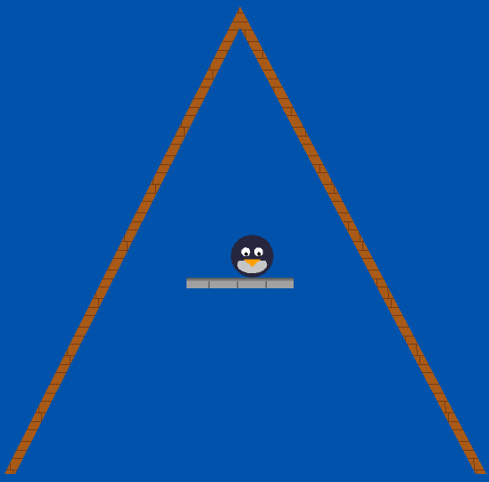

# penguin-game

In this game, you control a penguin. Being a penguin, you cannot fly or jump. However, you can propel yourself using your rocket launcher. Execute your moves precisely and learn unusual movement techniques to get to the goal.

This game is in very early development, but you can test it out in the browser:

- URL: https://decorator-factory.github.io/penguin-game/

- Demo URL: https://decorator-factory.github.io/penguin-game/#demo (the penguin will move on its own)

The available level is very short, intended to show the gist of the game. Your goal is to get to the platform inside the tower roof.



## Controls

The rules are simple: shoot a rocket under your feet, and the explosion blasts you away. Note that the rocket

- `A`: Go left
- `D`: Go Right
- Mouse cursor: aim the rocket launcher
- Left mouse button: shoot rocket
- `R`: speed up the game 5 times (for debugging and demo development purposes)

If you get stuck, see how the demo penguin completes the level.

## Building for desktop

1. Install Rust 1.90.0 or later and Cargo
2. Clone this repository, run `cargo build` in the repository directory
3. The resulting executable is now in `./target/debug/penguin-game`

If you want to build a faster release executable, run `cargo build --release` and look for the binary in `./target/release/penguin-game`

## Command-Line Interface (when running on desktop)

```
penguin-game

Usage:
    penguin-game
    penguin-game demo
    penguin-game record-demo --output-file <path>
    penguin-game keep-recording-demo --input-file <path> --output-file <path>
```

- `penguin-game` starts the game as expected
- `penguin-game demo` starts the demo movie
- `penguin-game record-demo --output-file movie.demo` records a demo movie and outputs it to `movie.demo` (that file must not already exist). The demo is saved in a simple text format that you can tweak yourself.

    ```
    penguindemo-text-v0
    #^ The demo file must start with exactly this magic line

    #  This is the frame number on which an action occurs.
    #  They must be in non-decreasing order.
    #  VVVV
    at  300: look 90    # look down to fly as high as possible
    at  300: on   shoot # ^^^ this is a comment
    at  304: off  shoot
    # Put comments before sections to make it easier to read the file
    at  316: on   left
    at  332: off  left
    ```

- `penguin-game keep-recording-demo --input-file movie1.demo --output-file movie2.demo`
    starts out playing the demo movie in `movie1.demo`, and when it's done, records a new demo movie and puts that into `movie2.demo`. This allows you to record complicated demos in multiple sittings. Note that the demo in `movie2.demo` is incomplete, you'll have to append it to `movie1.demo` manually.


## TODO list

- Improve collision physics, especially with polygons. I will probably end up using `rapier`, but who knows.

- Level editor. Unfortunately none of the existing open-source level editors are any good for this game.

- Demo recording and proper demo movie format

- Some sort of UI for selecting levels and congratulating the player when they win

- Checkpoints. This is intended to be a difficult game, but not a "rage game". So you should be able to return to save your progress and/or return to a previous point in the level if you screw up badly.

- Props, signs and other world objects to make the levels nice and intuitive

- Sounds

