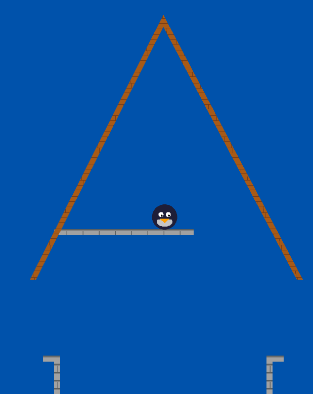

# penguin-game

In this game, you control a penguin. Being a penguin, you cannot fly or jump. However, you can propel yourself using your rocket launcher. Execute your moves precisely and learn unusual movement techniques to get to the goal.

This game is in very early development, but you can test it out in the browser:

- URL: https://decorator-factory.github.io/penguin-game/
- Demo URL: https://decorator-factory.github.io/penguin-game/#demo (the penguin will move on its own)

The goal is to get to the platform inside the tower roof.



That level is so lame though. Check out this new level. It has crocodiles in it so it might be scary.

- In-development level (WIP): https://decorator-factory.github.io/penguin-game/#new-level
- In-development level Demo: https://decorator-factory.github.io/penguin-game/#new-level-demo

## Controls

The rules are simple: shoot a rocket under your feet, and the explosion blasts you away. Note that the rocket

- `A`: Go left
- `D`: Go Right
- Mouse cursor: aim the rocket launcher
- Left mouse button: shoot rocket

Debug controls:
- `Q`/`E`: slow down or speed up the game. You can see the `target UPS` label in the top left to find out the current UPS.
    The game is intended to be played at 240 ticks per second, but for examining demo 

If you get stuck, see how the demo penguin completes the level.

## Command-Line Interface (when running on desktop)

```
penguin-game

Usage:
    penguin-game play [--new-level]
    penguin-game demo [--input-file <path>] [--skip-until-update <upd>]
    penguin-game record-demo --output-file <path>
    penguin-game keep-recording-demo --input-file <path> --output-file <path>
    penguin-game re-record-demo --input-file <path> --output-file <path>
```

- `penguin-game play` starts the game as expected
- `penguin-game demo` shows a demo movie; if no input is provided, the built-in demo movie (found in `demos/intended.demo`) is played
- `penguin-game record-demo --output-file movie.demo` records a demo movie and outputs it to `movie.demo` (that file must not already exist). The demo is saved in a simple text format that you can tweak yourself.

    ```
    penguindemo-text-v0
    #^ The demo file must start with exactly this magic line

    #  This is the update number on which an action occurs.
    #  They must be in non-decreasing order.
    #  VVVV
    at  300: look 90    # look down to fly as high as possible
    at  300: on   shoot # ^^^ this is a comment
    at  304: off  shoot
    # Put comments before sections to make it easier to read the file
    at  316: on   left
    at  332: off  left
    ```

- `penguin-game keep-recording-demo --input-file movie1.demo --output-file movie2.demo`
    starts out playing the demo movie in `movie1.demo`, and when it's done, records a new demo movie and puts that into `movie2.demo`. This allows you to record complicated demos in multiple sittings. Note that the demo in `movie2.demo` is incomplete, you'll have to append it to `movie1.demo` manually.

- `penguin-game re-record-demo --input-file movie1.demo --output-file movie2.demo` plays a demo and records it into a demo.
    it exists for re-encoding existing demos in a new format.

## TODO list

- Some sort of UI for selecting levels and congratulating the player when they win

- Checkpoints. This is intended to be a difficult game, but not a "rage game". So you should be able to return to save your progress and/or return to a previous point in the level if you screw up badly.

- Props, signs and other world objects to make the levels nice and intuitive

- Sounds

## Development

You need Rust 1.90.0 or later and Cargo.

1. `cargo build`
1. `cargo test`
1. `cargo clippy --target wasm32-unknown-unknown`
1. `cargo clippy`
1. `cargo clippy --target wasm32-unknown-unknown`
1. `cargo run -- play`

Auto-format code with `cargo +nightly fmt`.

Note that to update the levels, you currently need to consult `tiled/README.md`.
